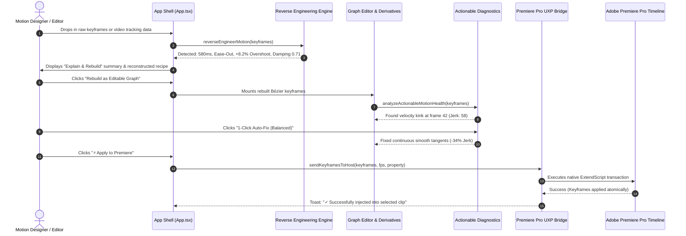

# 🏗️ Motion Studio — System Architecture & Interconnection Map

> This document provides a high-level architectural overview of the **Motion Studio** codebase, showing how all core engines, feature studios, math primitives, and host adapters connect and communicate with each other.

---

## 🗺️ 1. Multi-Layer System Topology

```mermaid
flowchart TD
    subgraph Layer1["1. PRESENTATION & STUDIO SHELL (src/app/ & src/features/)"]
        App["App.tsx<br/>(Top Suite Navigation & Global State)"]
        
        S1["🎬 Graph Editor"]
        S2["🎥 Live Canvas & Timeline"]
        S3["🧱 Animation Builder & Stack"]
        S4["📝 Text & Typography Studio"]
        S5["💬 Caption Studio"]
        S6["🧠 Explain & Rebuild Studio"]
        S7["🧪 Physics Motion Sandbox"]
        S8["🎭 Animation State Machine"]
        S9["🔀 Animation Git & Diff"]
        S10["🎨 Design System Studio"]
        S11["🧠 Logic Graph Studio"]
        S12["🌌 3D Scene Studio"]
        S13["👥 A/B Review View"]
        S14["🧬 Motion DNA Panel"]
        S15["🎯 Responsive Lab"]
        S16["🏛️ Preset Studio"]
        S17["📦 Export Hub"]
        
        App --> S1 & S2 & S3 & S4 & S5 & S6 & S7 & S8 & S9 & S10 & S11 & S12 & S13 & S14 & S15 & S16 & S17
    end

    subgraph Layer2["2. CORE KINEMATIC & INTELLIGENCE ENGINES (src/core/)"]
        M1["📐 Bézier & Derivative Solvers<br/>(derivativesGraphEngine.ts, motionMatchingEngine.ts)"]
        M2["🧠 Motion Reverse Engineering<br/>(motionReverseEngineering.ts, proceduralMotionGenerator.ts)"]
        M3["🧬 Motion DNA Search Engine<br/>(motionDnaSearchEngine.ts, motionDnaEngine.ts)"]
        M4["🧪 2D Physics Simulator<br/>(physicsSandboxEngine.ts)"]
        M5["🎭 State Machine Engine<br/>(animationStateMachine.ts)"]
        M6["🔀 Animation Git & Diff<br/>(animationGitEngine.ts)"]
        M7["🎛️ Universal Motion Controllers<br/>(motionControllerEngine.ts, propertyRegistry.ts)"]
        M8["🧱 Modifier Stack & Spring Physics<br/>(animationStackEngine.ts, parametricPresetEngine.ts)"]
        M9["📝 Text & Typography Engine<br/>(textTargetingEngine.ts, kineticTypographyEngine.ts, typewriterEngine.ts)"]
        M10["💬 Caption & Timing Subsystem<br/>(wordTimingEngine.ts, rippleEditingEngine.ts, captionCollisionEngine.ts)"]
        M11["🎨 Design Tokens & Components<br/>(designSystemEngine.ts, componentCatalog.ts)"]
        M12["🧠 Logic Node Execution Graph<br/>(motionLogicGraph.ts)"]
        M13["🌌 2.5D / 3D Perspective & Particles<br/>(scene3dEngine.ts, particleEngine.ts)"]
        M14["🎯 Responsive Constraint Solver<br/>(responsiveMotionEngine.ts, constraintLayoutEngine.ts)"]
    end

    subgraph Layer3["3. DATA MODEL & STATE PIPELINE"]
        UMM["🌐 Universal Animation & Motion Model<br/>(universalAnimationModel.ts)"]
        CMD["🧩 Universal Command History<br/>(commandManager.ts, universalSelectionStore.ts, universalClipboardManager.ts)"]
        Storage["💾 Local Storage & Auto-Save<br/>(autoSaveRecovery.ts, workspaceManager.ts)"]
        SDK["🔌 Motion Studio Extension SDK<br/>(motionStudioSdk.ts)"]
    end

    subgraph Layer4["4. HOST ADAPTERS & EXPORTERS (src/adapters/ & src/features/export/)"]
        UXP["⚡ Premiere Pro Live UXP Bridge<br/>(UxpBridge.ts, PremiereAdapter.ts)"]
        AE["After Effects (Clipboard / JSX)"]
        Resolve["DaVinci Resolve (Fusion Splines)"]
        Web["Web & Lottie (CSS linear, GSAP, Framer, WAAPI)"]
        Games["Game Engines (Unity C#, Unreal Engine 5)"]
    end

    Layer1 --> Layer2
    Layer2 --> Layer3
    Layer3 --> Layer4
```

---

## 🔄 2. End-to-End Motion Lifecycle Sequence

---

## 📁 3. Directory Mapping & Ownership

| Directory | Primary Responsibility |
| :--- | :--- |
| `src/core/intelligence/` | Motion Reverse Engineering, Kinematic Deconstruction, and Recipe Synthesis. |
| `src/core/generator/` | Zero-AI Procedural Motion Generator with 6 parametric sliders. |
| `src/core/search/` | Motion DNA Search Engine with 5D parametric similarity and semantic query parsing. |
| `src/core/physics/` | 2D Physics Simulator (Gravity, Mass, Friction, Restitution Collisions). |
| `src/core/states/` | Animation State Machine (Idle $\to$ Hover $\to$ Pressed $\to$ Active) and Framer Motion code generator. |
| `src/core/git/` | Animation Git branch manager and kinematic motion diff engine. |
| `src/core/math/` | Numerical derivative solvers (Velocity, Accel, Jerk), Motion Matching, and Reference Ghost Curves. |
| `src/core/recipes/` | Structured Motion Recipe schemas (Entrance, Emphasis, Exit) and Bézier compilers. |
| `src/core/analysis/` | Actionable Diagnostics Engine with 3 Auto-Fix modes (Conservative, Balanced, Aggressive). |
| `src/core/commands/` | Universal Command Pattern managing atomic, reversible Undo/Redo across all studios. |
| `src/core/selection/` | Universal Selection Store unifying layer, keyframe, property, and word selections. |
| `src/core/clipboard/` | Universal Cross-Subsystem Clipboard for copying and pasting motion, timing, and recipes. |
| `src/features/reverse-engineering/` | Interactive "Explain & Rebuild This Motion" studio panel. |
| `src/features/physics-sandbox/` | Interactive 2D physics sandbox with bouncing ball/box and live curve output. |
| `src/features/state-machine/` | Interactive state machine canvas with Framer Motion code exporter. |
| `src/features/git/` | Animation Git branch switcher and visual motion diff matrix. |
| `src/features/library/` | Visual Motion Recipe Browser with categorized cards and live previews. |
| `src/adapters/uxp/` | Adobe Premiere Pro UXP ExtendScript bridge and live clip synchronization. |

---

## 🔒 4. Local-First & Zero-Cost Architecture Guarantee

1. **Zero Cloud API Subscriptions**: All mathematical simulations, kinematic deconstruction, DNA searching, physics integration, and caption parsing execute directly in the local JavaScript runtime.
2. **Deterministic & Fast**: Every algorithm runs at 60fps with instant real-time feedback.
3. **Atomic Undo/Redo**: All modifications route through `GlobalCommandManager` ensuring reversible transactions across the application.
