# 🎬 Motion Studio — Complete 500-Feature Architecture & Specification

> **Motion Studio** is a standalone, local-first, zero-cloud-cost motion design system, animation graph editor, universal timeline workspace, and caption motion engine for video creators, animators, and web developers.

---

## 🏗️ High-Level System Architecture

```mermaid
flowchart TD
    subgraph Inputs["1. LOCAL INPUTS & ASSETS (100% Free & Local)"]
        A1["Raw Text & Voice Scripts"]
        A2["SRT / VTT / ASS / JSON Subtitles"]
        A3[".motionstudio & .motionpkg Files"]
        A4["CSV / JSON Datasets"]
        A5["Multi-Track Audio & Speech Waves"]
        A6["B-Roll Media Library (4K/HD Footage, Overlays)"]
    end

    subgraph CoreEngines["2. 🧬 CORE MATHEMATICAL, KINEMATIC & DSP ENGINES (20 DOMAINS)"]
        B0["📈 Blender-Style Curve Engine (Auto-Clamped, Vector, Aligned, Free, Flip X/Y, Quantize, RDP Simplify)"]
        B1["✨ VFX Shaders & Optics (Anamorphic Lens Flares, Glitch Displace, Lightning Arcs, Curl Noise)"]
        B2["🎙️ Speech-to-Motion Captions (SRT/VTT/JSON Parser, 47 Trendy Presets, Semantic Auto-Emojis 💰🔥🚀)"]
        B3["🎬 Universal B-Roll Engine (Media Browser, Ken Burns Motion, 128 BPM Beat Sequencer, Keyframe Baker)"]
        B4["📊 Data-Driven Infographics (Racing Bar Charts, Dynamic Line Graphs, Odometer Counters)"]
        B5["🎨 3-Way Color Grading & Film LUTs (Lift/Gamma/Gain Wheels, Kodak 2383/Fuji 3513, 3D .cube LUT Generator)"]
        B6["🌌 GPU Particle Storm & Vortex Engine (Sparks, Falling Snow, Confetti, Smoke Plumes, 60 FPS Canvas)"]
        B7["🪄 Smart Auto-Roto & Local Matte (Point-and-Click Vector Masks, Optical Flow Bounding Box Tracker)"]
        B8["🗺️ 3D Spatial Matchmove & Corner-Pin (4-Point Planar Homography Matrix, Screen Replacement)"]
        B9["📱 Viral Social Auto-Reframe (16:9 to 9:16 Crop Box Math, Subject Auto-Centering Pan Tracker)"]
        B10["⚡ Preset Marketplace & Local Vault (.motionpkg Bundle Serializer/Deserializer, 1-Click Installer)"]
        B11["🔤 Extended Kinetic Typography & UI (Liquid Chrome, Hormozi Captions, MrBeast Comic, Dynamic Island, Neumorphism)"]
        B12["🎥 3D Camera & Parallax Engine (18-200mm Perspective, Vertigo Dolly Zoom, DoF Bokeh, 2.5D Parallax)"]
        B13["🔀 Universal Transitions & Wipes (Directional Wipe, Radial Clock, Iris Circle, Despill, Light Wrap)"]
        B14["📐 Advanced Calculus & Splines (RK4 Integrator, TCB Splines, Curvature Profile, Poisson Disc)"]
        B15["🧬 Motion DNA Intelligence (10D Similarity, Continuous Morphing, Git-Diff, Auto-Optimizer)"]
        B16["🧪 Universal Physics World (Symplectic Euler, Multi-Body Collisions, Springs, Wind, Materials)"]
        B17["🧠 Procedural Animation Graph (46+ Nodes, Math, Trig, Vectors, 2nd-Order Spring, Perlin Noise)"]
        B18["🎞️ Universal Multi-Track Timeline (SMPTE Ruler, NLE Ripple/Slip/Roll/Slide, Parenting, Beat Sync)"]
        B19["🦾 Complete Constraint & Rigging (2-Bone IK, Universal Property Binding, Flexbox Auto-Hug)"]
        B20["🎵 Audio-Reactive & Foley Synthesizer (8-Band FFT, BPM Tracker, Whoosh/Pop/808 Foley Engine)"]
    end

    subgraph ProductionSuites["3. PRODUCTION DESIGN SUITES"]
        C1["🎬 World-Class Motion Graph (Bézier Math, Velocity/Accel/Jerk Graphs)"]
        C2["🧠 Explain & Rebuild Studio (Motion Reverse Engineering)"]
        C3["🪄 Procedural Motion Generator (Zero-Cost Math Engine)"]
        C4["🎭 Animation State Machine (Multi-State Interactive UI & Framer Exporter)"]
        C5["🔀 Animation Git & Diff (Branching & Kinematic Parameter Deltas)"]
        C6["💬 Caption Studio (Word Timings, Karaoke Sweeps, Ripple Edit)"]
        C7["🎨 Design System Studio (Design Tokens, Component Library)"]
        C8["🌌 2.5D / 3D Scene & Camera (Depth Layers, Dolly Rigs, Particles)"]
    end

    subgraph Infrastructure["4. PERFORMANCE, RELIABILITY & PROJECT ENGINE"]
        D1["⚡ Real-Time Performance Monitor (FPS, Frame Budget, Subsystem Bottleneck Profiler)"]
        D2["🛟 Crash Recovery Journal (Atomic Snapshots, Watchdog, Checksums)"]
        D3["💾 .motionstudio Project Format (Bundle Serialization & Migration)"]
        D4["⌘K Global Command Palette (Keyboard-First Navigation & Shortcuts)"]
        D5["🧪 Deterministic Test Suite (Math Verification & Exporter Golden Fixtures)"]
    end

    subgraph ExportHub["5. UNIFIED SCALABLE HOST INTERCHANGE"]
        E1["⚡ Multi-Host Code Generators (Premiere Pro UXP, After Effects JSX, Resolve Fusion Lua, FCPXML, Blender Python)"]
        E2["🌐 Web Code Exporters (Lottie JSON, React Framer Motion TSX, Vanilla CSS @keyframes, GSAP)"]
        E3["Non-Destructive Keyframe Insertion (Replace, Merge-Preserve, Additive-Offset)"]
        E4["Timebase Converter (23.976, 24, 25, 29.97, 30, 59.94, 60 fps)"]
    end

    Inputs --> CoreEngines
    CoreEngines --> ProductionSuites
    ProductionSuites --> Infrastructure
    Infrastructure --> ExportHub
```



---

## 📋 Comprehensive 20-Domain Production Matrix (500 Features)

| Domain | Scope & Key Capabilities |
| :--- | :--- |
| **01. 📈 Graph Editor & Keyframing** | Multi-channel curves, Auto-Clamped/Vector/Free handles, RDP simplify, calculus HUD ($v, a, j$), curvature profile $\kappa(t)$, RK4 ODE integrator. |
| **02. 🎨 Vector Shapes & Booleans** | Parametric Star/Polygon/Capsule/Heart, path morphing ($0\% \to 100\%$), trim paths, radial/grid repeaters, Greiner-Hormann booleans. |
| **03. 🔤 Kinetic Typography** | Liquid Molten Chrome, Alex Hormozi captions, MrBeast comic text, Split-flap flip board, Cyberpunk neon, fluid `clamp()` math. |
| **04. 🦾 Rigging, IK & Characters** | 2-Bone analytic IK with pole vectors, FABRIK multi-joint IK, spline IK, jiggle bone physics, rubber-hose stretch, pose library. |
| **05. 🧪 Physics & Continuum Dynamics** | Symplectic Euler solver, Verlet cloth/rope, soft-body jelly, 60 FPS canvas particle engine (Sparks, Snow, Confetti, Smoke). |
| **06. ✨ VFX Shaders & Stylization** | Multi-element anamorphic lens flares, chromatic aberration RGB split, CRT scanlines, lightning electrical arcs, frosted glassmorphism, heat wave shimmer. |
| **07. 🎥 3D Camera & Parallax** | $18\text{mm} \to 200\text{mm}$ perspective camera, DoF bokeh, 2.5D multi-plane parallax, Vertigo dolly zoom, handheld shake generator. |
| **08. 🎨 Color Science & Film LUTs** | 3-Way color wheels (Lift/Gamma/Gain), Kodak 2383/Fuji 3513 film stock emulation, false color exposure maps, 3D `.cube` LUT exporter. |
| **09. 🎵 Audio DSP & Foley Synth** | 8-Band spectral FFT, zero-cost Foley synthesizers (Whoosh, Pop, 808 Sub-Bass, Braam Horn), auto-ducking, beat transient snapping. |
| **10. 👁️ 3D Matchmove & Tracking** | 4-Point planar homography corner-pin, vector roto masks, edge feathering ($0\text{px} \to 32\text{px}$), local optical flow tracking. |
| **11. ✂️ NLE Editing & Multi-Cam** | Multi-track timeline, SMPTE timecode, Ripple/Slip/Slide/Roll tools, non-linear Bézier speed ramps, multi-cam waveform sync. |
| **12. 🎬 B-Roll & Beat Sequencer** | Media browser (4K/HD/GIFs), Ken Burns dynamic pan/zoom framing, 128 BPM music beat-synced montage sequencer, keyframe baker. |
| **13. 📊 Data-Driven Infographics** | Racing bar charts with real-time rank swapping, procedural line/area graphs, rolling odometer counters from CSV/JSON datasets. |
| **14. 📱 Viral Social Auto-Reframe** | 16:9 $\to$ 9:16 vertical crop window with talking-head subject centering for TikTok/Reels/Shorts, top 3-second retention hook cards. |
| **15. 🖱️ UI Design Systems & Mockups** | Dynamic Island squircle, skeleton loading shimmer, elastic toggle switch, 3D card flip, device mockup frames, 8px grid tokens. |
| **16. 🧠 Procedural Node Graphs** | 46+ visual math, trig, vector, 2nd-order spring, Perlin noise, and conditional nodes with 1-click keyframe baking. |
| **17. 🔀 Transitions & Light Leaks** | Directional wipe, radial clock, iris circle, whip pan, zoom push, glitch displace, amber film burn light leak, ink bleed. |
| **18. 🎭 Masking, Mattes & Compositing** | Per-vertex feathering, alpha/luma track mattes (Multiply, Screen, Overlay, Color Dodge), green-screen despill, light wrap. |
| **19. 🧬 Motion DNA & Living Presets** | 10D kinetic DNA extraction, Euclidean vector matching, continuous morphing ($0\% \to 100\%$), living parametric spring/bounce presets. |
| **20. ⚡ Universal Host Bridges & SDK** | Direct export to Premiere Pro UXP, After Effects JSX, Resolve Fusion Lua, FCPXML, Blender Python, Lottie, React Framer, GSAP, CSS. |

---

## 🚀 Universal Host Bridge & Interchange Workflow

```
[🎬 Motion Graph] [🎞️ Universal Timeline] [🦾 Constraints] [🎬 B-Roll] [📊 Infographics] [🎨 Color & LUTs] [🌌 Particle Storm] [🪄 Smart Roto] [🗺️ 3D Matchmove] [🎙️ Speech Captions] [📱 Social Reframe] [⚡ Marketplace] [✨ VFX Shaders] ... [⚡ Export ▾]
```

All 500+ capabilities operate **100% locally with zero cloud subscriptions, zero third-party API fees**, and complete cross-application interchangeability.
