# 🎬 Motion Studio — Complete 518-Feature Architecture & Specification

> **Motion Studio** is a standalone, local-first, zero-cloud-cost motion design system, animation graph editor, universal timeline workspace, and caption motion engine for video creators, animators, and web developers.

---

## 🏗️ High-Level System Architecture

```mermaid
flowchart TD
    subgraph Inputs["1. LOCAL INPUTS & ASSETS (100% Free & Local)"]
        A1["Raw Text & Scripts"]
        A2["SRT / VTT / ASS Transcripts"]
        A3[".motionstudio Project Files"]
        A4["Reference Motion Curves (JSON/CSV)"]
        A5["Multi-Track Audio & Speech Waves (WAV/MP3/FLAC/Mic)"]
    end

    subgraph CoreEngines["2. 🧬 CORE MATHEMATICAL, KINEMATIC & DSP ENGINES"]
        B0["📈 Blender-Style Curve Engine (Auto-Clamped, Vector, Aligned, Free, Flip X/Y, Quantize, RDP Simplify)"]
        B1["📐 Advanced Calculus & Splines (RK4 Integrator, TCB Splines, Curvature Profile, Poisson Disc)"]
        B2["🧬 Motion DNA Intelligence (10D Similarity, Continuous Morphing, Git-Diff, Auto-Optimizer)"]
        B3["🎨 Advanced Vector & Typography (Parametric Morphing, Trim Path Write-On, Scramble Cipher, Kinetic Wave)"]
        B4["🧪 Universal Physics World (Symplectic Euler, Multi-Body Collisions, Springs, Wind, Materials)"]
        B5["🧠 Procedural Animation Graph (46+ Nodes, Math, Trig, Vectors, 2nd-Order Spring, Perlin Noise)"]
        B6["🎞️ Universal Multi-Track Timeline (SMPTE Ruler, NLE Ripple/Slip/Roll/Slide, Parenting, Beat Sync)"]
        B7["🦾 Complete Constraint & Rigging (2-Bone IK, Universal Property Binding, Flexbox Auto-Hug)"]
        B8["🎵 Audio-Reactive & Foley Synthesizer (8-Band FFT, BPM Tracker, Whoosh/Pop/808 Foley Engine)"]
        B9["🎯 Responsive Motion Lab (5-Level Adaptive Motion, Safe-Area Protection, CSS/Framer Exporters)"]
        B10["🎨 Color Science & LUT Studio (ACEScc, 3-Way Wheels, Kodak/Fuji Emulation, 3D .cube Generator)"]
        B11["✨ Procedural VFX & Shaders (Curl Noise, Chromatic Aberration, CRT Scanlines, Lens Flares)"]
        B12["🤖 Local AI Procedural Assistant (1-Click Polish, Jitter Cleaner, Contrast Styler, Cohesion Scorer)"]
    end

    subgraph ProductionSuites["3. PRODUCTION DESIGN SUITES"]
        C1["🎬 World-Class Motion Graph (Bézier Math, Velocity/Accel/Jerk Graphs)"]
        C2["🧠 Explain & Rebuild Studio (Motion Reverse Engineering)"]
        C3["🪄 Procedural Motion Generator (Zero-Cost Math Engine)"]
        C4["🎭 Animation State Machine (Multi-State Interactive UI & Framer Exporter)"]
        C5["🔀 Animation Git & Diff (Branching & Kinematic Parameter Deltas)"]
        C6["💬 Caption Studio (Word Timings, Karaoke Sweeps, Ripple Edit)"]
        C7["🎨 Design System Studio (Design Tokens, Component Library)"]
        C8["🌌 2.5D / 3D Scene & Camera (Depth Layers, Dolly Rigs, Particles)"]
    end

    subgraph Infrastructure["4. PERFORMANCE, RELIABILITY & PROJECT ENGINE"]
        D1["⚡ Real-Time Performance Monitor (FPS, Frame Budget, Subsystem Bottleneck Profiler)"]
        D2["🛟 Crash Recovery Journal (Atomic Snapshots, Watchdog, Checksums)"]
        D3["💾 .motionstudio Project Format (Bundle Serialization & Migration)"]
        D4["⌘K Global Command Palette (Keyboard-First Navigation & Shortcuts)"]
        D5["🧪 Deterministic Test Suite (Math Verification & Exporter Golden Fixtures)"]
    end

    subgraph ExportHub["5. UNIFIED SCALABLE HOST INTERCHANGE"]
        E1["⚡ Unified Host Bridge (Premiere Pro UXP, After Effects JSX, Resolve Fusion, Web Lottie)"]
        E2["Non-Destructive Keyframe Insertion (Replace, Merge-Preserve, Additive-Offset)"]
        E3["Timebase Converter (23.976, 24, 25, 29.97, 30, 59.94, 60 fps)"]
        E4["🔌 Motion Studio Extension SDK (Custom Modifiers, Presets, Nodes)"]
    end

    Inputs --> CoreEngines
    CoreEngines --> ProductionSuites
    ProductionSuites --> Infrastructure
    Infrastructure --> ExportHub
```



---

## 📋 Comprehensive 27-Category Feature Matrix (518 Features)

| Category | Domain | Key Capabilities |
| :--- | :--- | :--- |
| **01** | **📐 Advanced Math & Calculus** | RK4 ODE integrator, Catmull-Rom $\to$ Bézier matrix conversion, TCB splines, Curvature $\kappa(t)$, Poisson Disc sampling, Bilateral curve filtering. |
| **02** | **🔤 Kinetic Typography & Speech** | OpenType glyph parser, local Whisper.cpp alignment, variable font axes, matrix scramble glitch, karaoke sweeps, text shatter. |
| **03** | **🧪 Physics & Continuum Dynamics** | PBD/XPBD cloth, SPH fluid splashes, Navier-Stokes smoke, soft-body jelly, tearing cloth, aerodynamic wind drag, CCD collisions. |
| **04** | **🎵 Audio DSP & Music Theory** | Multi-resolution FFT, Constant-Q musical notes, Chromagram chord tracker, HPSS drum/melody separation, PLL BPM tracking. |
| **05** | **👁️ Computer Vision & Tracking** | Pyramidal Lucas-Kanade flow, 4-point planar homography, video stabilization, 3D camera solver, 9:16 auto-framing, facial mesh. |
| **06** | **🦾 Rigging, IK & Character Rigs** | FABRIK multi-joint solver, 2-bone analytic IK, spline IK, jiggle bone physics, dual quaternion skinning, walk cycle generator. |
| **07** | **🎨 Vector Compositing & Booleans** | Greiner-Hormann booleans (Union, Sub, Intersect), variable width spline strokes, Catmull-Rom mesh gradients, autotracer. |
| **08** | **🌌 2.5D/3D Scene, Camera & Depth** | 3D perspective camera ($mm/f$-stop), DoF bokeh, 2.5D multi-plane parallax, 3D PCF soft shadows, glTF model loader, SSAO. |
| **09** | **🎨 Color Science, LUTs & HDR** | ACEScc/cg pipeline, 3D .cube LUT generator, 3-way color wheels, Kodak 2383/Fuji 3513 film print emulation, false color maps. |
| **10** | **✂️ Video NLE Power Tools** | Dead-air silence stripper, auto-jumpcut pacer, multi-cam waveform sync, velocity-preserving speed ramps, FCPXML/EDL export. |
| **11** | **🧬 Motion DNA & Living Presets** | 10D kinetic DNA extraction, Euclidean vector matching, continuous morphing ($0\% \to 100\%$), 1-click jerk auto-optimizer. |
| **12** | **🧠 Procedural Node Graph** | 46+ visual math, trig, vector, 2nd-order spring, Perlin noise, and conditional nodes with 1-click keyframe baking. |
| **13** | **⚡ Universal Export & Host Hub** | Adobe Premiere Pro UXP, After Effects JSX, DaVinci Resolve Fusion, FCPXML, Blender Python, Lottie, React Framer, GSAP, CSS. |
| **14** | **⚙️ Performance, GPU & WASM** | Web Worker math offloading, WebGL/WebGPU shaders, $O(n)$ spatial grid collisions, zero-GC memory pools, WASM DSP core. |
| **15** | **⌨️ Editor UX & Productivity** | `⌘K` Command palette, custom shortcut keymapper (Blender/AE/Premiere), dark theme HSL, atomic crash recovery watchdog. |
| **16** | **🎥 Cinematic Camera & Optics** | Anamorphic oval bokeh, chromatic aberration fringe, Scheimpflug tilt-shift, Vertigo dolly zoom, $\cos^4\theta$ natural vignetting. |
| **17** | **✨ VFX, Shaders & Noise** | Divergence-free curl noise, Gray-Scott reaction-diffusion, CRT scanlines, lens flare streaks, burning embers dissolve, SSR reflections. |
| **18** | **🎭 Masking, Mattes & Roto** | Per-vertex feathering, affine roto propagation, core/soft matte split, difference keying, color despill, additive light wrap. |
| **19** | **⏱️ Speed Ramps & Optical Flow** | Non-linear Bézier time-remapping, $1000\text{ FPS}$ slow-mo interpolation, pitch-preserved audio stretch, time-displacement maps. |
| **20** | **🔊 Foley & Sound Synthesis** | Procedural Whoosh, UI Pop, 808 Sub-Impact, and Braam horn synthesizers, automatic dialogue ducking, 10-band parametric EQ. |
| **21** | **📐 UI Design Systems & Tokens** | Figma Tokens JSON import, WCAG AAA contrast checker, flexbox auto-padding, device mockup frames (iPhone 16/MacBook), glassmorphism. |
| **22** | **🌀 Generative Procedural Art** | L-System fractal trees, Mandelbrot zoomer, Spirograph roulettes, Chladni acoustic nodal plates, Voronoi shatter, 2D metaballs. |
| **23** | **🗂️ Workflow, Git & Collab** | Local Git commit history, split-screen branch comparator, video markup pen tool, change delta heatmaps, 60s auto-recovery snapshots. |
| **24** | **🔌 Scripting & Developer SDK** | JS/TS DOM scripting API, Python pipeline bridge, custom modifier loader, headless Node.js runner, MIDI/OSC hardware mapping. |
| **25** | **🧊 3D Scene Graph & glTF/USD** | Pixar USD exporter, glTF 2.0 PBR scene exporter, Cook-Torrance metallic-roughness shader, CSG 3D booleans, 3D curve lathe. |
| **26** | **📦 Codecs & Web Delivery** | WebCodecs GPU encoding, ProRes 422/4444 XQ, AV1/VP9, transparent alpha WebM, neural quantized GIF, MOOV fast-start optimizer. |
| **27** | **🤖 Local Procedural Assistants** | 1-Click motion polish optimizer, jitter cleanup, vocal cadence pacer, auto-contrast text styling, Motion DNA cohesion scorer. |

---

## 🚀 Usage & Host Bridge Workflow

```
[🎬 Motion Graph] [🎞️ Universal Timeline] [🦾 Constraints & Rigging] [🎨 Vector & Typography] [🎵 Audio Reactive] [🎯 Responsive Lab] [🧬 Motion DNA] [🧠 Logic Graph] [🧪 Physics Sandbox] ... [⚡ Export ▾]
```

All 518 capabilities run **100% locally with zero cloud dependencies, zero external subscription costs**, and full cross-application interchangeability across **Premiere Pro**, **After Effects**, **DaVinci Resolve**, **Blender**, and the **Web**.
