# 🎬 Motion Studio — Complete Feature Catalog & Architecture

> **Motion Studio** is a standalone, local-first, zero-cloud-cost motion design system, animation graph editor, universal timeline workspace, and caption motion engine for video creators, animators, and web developers.

---

## 🏗️ High-Level System Architecture

```mermaid
flowchart TD
    subgraph Inputs["1. LOCAL INPUTS & ASSETS (100% Free & Local)"]
        A1["Raw Text & Scripts"]
        A2["SRT / VTT / ASS Transcripts"]
        A3[".motionstudio Project Files"]
        A4["Reference Motion Curves (JSON/CSV)"]
        A5["Multi-Track Audio & Speech Waves (WAV/MP3/FLAC/Mic)"]
    end

    subgraph MotionDnaCore["2. 🧬 BLENDER CURVES, MOTION DNA & PROCEDURAL CORE"]
        B0["📈 Blender-Style Curve Engine<br/>(Auto-Clamped, Vector, Aligned, Free, Flip X/Y, Stretch 2x, Quantize, RDP Simplify)"]
        B1["🧬 Motion DNA Universal Engine<br/>(Extract, Vector Similarity, DNA Morphing 0-100%, Git-Diff, Auto-Optimizer)"]
        B2["🎨 Advanced Vector & Typography Engine<br/>(Parametric Morphing, Trim Path Write-On, Scramble Cipher, Kinetic Wave)"]
        B3["🧪 Universal Physics World & Simulation<br/>(Symplectic Euler, Multi-Body Collisions, Springs, Wind, Materials, Keyframe Baker)"]
        B4["🧠 Procedural Animation Graph<br/>(46+ Nodes, Math, Trig, Vectors, 2nd-Order Spring, Perlin Noise, Keyframe Baker)"]
        B5["🎞️ Universal Multi-Track Timeline<br/>(SMPTE Ruler, NLE Ripple/Slip/Roll/Slide, Parenting, Beat Sync)"]
        B6["🦾 Complete Constraint & Rigging System<br/>(2-Bone IK, Universal Property Binding, Flexbox Auto-Hug, 1-Click Auto-Rig)"]
        B7["🎵 Audio-Reactive Motion Engine<br/>(8-Band Spectral FFT, BPM Tracker, Modulation Graph, 1-Click Baker)"]
        B8["🎯 Responsive Motion Lab & Breakpoints<br/>(5-Level Adaptive Motion, Safe-Area Protection, CSS/Framer Code Generators)"]
        B9["🧩 Motion Batch Processor<br/>(100+ Layers, Stagger, Timing, Before/After Previews)"]
        B10["📈 Dedicated Velocity Lab<br/>(Triple Synchronized Graphs, Normalization, Clamping, Retiming)"]
        B11["🧬 Advanced Motion Matching<br/>(Find Similar, Match Motion, Reference Optimization 18.4% -> 2.1%)"]
        B12["🏛️ Living Parametric Presets<br/>(Physical Sliders, Continuous Morphing, Variants, Live Extraction)"]
        B13["📋 Smart Motion Clipboard<br/>(Selective Masks, Cross-Property Normalization, Linked Master Binding)"]
    end

    subgraph ProductionSuites["3. PRODUCTION DESIGN SUITES"]
        C1["🎬 World-Class Motion Graph (Bézier Math, Velocity/Accel/Jerk Graphs)"]
        C2["🧠 Explain & Rebuild Studio (Motion Reverse Engineering)"]
        C3["🪄 Procedural Motion Generator (Zero-Cost Math Engine)"]
        C4["🎭 Animation State Machine (Multi-State Interactive UI & Framer Exporter)"]
        C5["🔀 Animation Git & Diff (Branching & Kinematic Parameter Deltas)"]
        C6["💬 Caption Studio (Word Timings, Karaoke Sweeps, Ripple Edit)"]
        C7["🎨 Design System Studio (Design Tokens, Component Library)"]
        C8["🌌 2.5D / 3D Scene & Camera (Depth Layers, Dolly Rigs, Particles)"]
    end

    subgraph Infrastructure["4. PERFORMANCE, RELIABILITY & PROJECT ENGINE"]
        D1["⚡ Real-Time Performance Monitor (FPS, Frame Budget, Subsystem Bottleneck Profiler)"]
        D2["🛟 Crash Recovery Journal (Atomic Snapshots, Watchdog, Checksums)"]
        D3["💾 .motionstudio Project Format (Bundle Serialization & Migration)"]
        D4["⌘K Global Command Palette (Keyboard-First Navigation & Shortcuts)"]
        D5["🧪 Deterministic Test Suite (Math Verification & Exporter Golden Fixtures)"]
    end

    subgraph ExportHub["5. UNIFIED SCALABLE HOST INTERCHANGE"]
        E1["⚡ Unified Host Bridge (Premiere Pro UXP, After Effects JSX, Resolve Fusion, Web Lottie)"]
        E2["Non-Destructive Keyframe Insertion (Replace, Merge-Preserve, Additive-Offset)"]
        E3["Timebase Converter (23.976, 24, 25, 29.97, 30, 59.94, 60 fps)"]
        E4["🔌 Motion Studio Extension SDK (Custom Modifiers, Presets, Nodes)"]
    end

    Inputs --> MotionDnaCore
    MotionDnaCore --> ProductionSuites
    ProductionSuites --> Infrastructure
    Infrastructure --> ExportHub
```



---

## 📋 Comprehensive Feature Catalog

### 1. 📈 Blender-Style Curve Engine & 5-Mode System (30+ Features)
| Category | What It Does |
| :--- | :--- |
| **Handle Types** | **Auto-Clamped** (flattens extrema), **Vector** (linear slopes pointing to neighbors), **Aligned**, and **Free** Bézier handles. |
| **Curve Transformations** | **Flip Time (⇄ Reverse)**, **Invert Values (⇅ Invert)**, **2× Stretch Duration**, **Quantize Frames**, and **Distribute Keyframes**. |
| **Intelligent Curve Simplification** | Ramer-Douglas-Peucker tolerance algorithm reducing dense keyframes while preserving curve extrema and bounce peaks. |
| **Calculus Telemetry** | Real-time derivative readouts for Peak Velocity ($v_{\max}$), Peak Acceleration ($a_{\max}$), Max Jerk ($j_{\max}$), and Smoothness Score ($0\text{–}100$). |
| **5-Mode Curve Switcher** | Fast switching between **Classic Curves**, **Velocity Lab**, **Procedural Graph**, **Physics Sim**, and **Motion DNA**. |

---

### 2. 🎨 Advanced Vector Shapes & Kinetic Typography Studio (56+ Features)
| Category | What It Does |
| :--- | :--- |
| **Parametric Vector Shapes** | Star (5 to 12 points), Circle, Ellipse, Polygon/Hexagon, Diamond, Capsule, Heart, Ring, and Rounded Rectangles. |
| **Continuous Shape Morphing** | Interpolates vertex geometry between arbitrary shapes (e.g. *Circle $\leftrightarrow$ Star $\leftrightarrow$ Polygon $\leftrightarrow$ Heart*) from $0\% \to 100\%$. |
| **Trim Path Write-On** | Percentage-based stroke start/end trimming for animated line drawings, reveals, and progress rings. |
| **Radial & Grid Repeaters** | Clones vector shapes radially with progressive rotation and scale stagger offsets. |
| **Matrix Cipher Scramble** | Cyberpunk glitch reveal replacing unresolved letters with matrix cipher symbols (`#$%*@!&`) decoding left-to-right. |
| **Kinetic Harmonic Wave** | Harmonic sine wave oscillation traveling across character Y positions. |
| **Elastic Spring Pop** | 2nd-order harmonic spring scale and rotation overshoot per letter. |

---

### 3. 🧪 Universal Physics World & Simulation System (50+ Features)
| Category | What It Does |
| :--- | :--- |
| **Symplectic Euler Integration** | Deterministic 60fps multi-body physics solver with configurable substeps ($1\text{ to }8$) and time scale. |
| **Material Physics Library** | Presets for **Rubber** ($e=0.85$), **Solid Metal**, **Wood**, **Soft Jelly / Blob**, **Smooth Ice** ($\mu=0.02$), **Foam**, and **Fabric**. |
| **Dynamic Multi-Body Collisions** | Circle-Circle, Circle-Box, ground bounce restitution, and boundary wall reflections. |
| **Active Force Fields** | Directional gravity, wind gusts with turbulence, point attractors/repulsors, fluid drag, and mouse impulse throwing. |
| **Intelligent Keyframe Baker** | Converts live physics simulations into optimized Bézier keyframes while strictly preserving collision extrema and bounce peaks. |

---

### 4. 🧠 Procedural Animation Graph & Programming System (46+ Features)
| Category | What It Does |
| :--- | :--- |
| **Comprehensive Node Palette** | Inputs (*Time, DeltaTime, Frame, Audio FFT, Mouse Distance, Char Index*), Math (*Add, Sub, Mul, Div, Modulo, Min/Max*), Trigonometry (*Sin, Cos, Tan, Atan2*), Vectors (*2D/3D Combine, Split, Distance, Lerp*), Interpolation (*Smoothstep, Remap, Easing*), Spring Dynamics (*Harmonic Frequency $f$, Damping $\zeta$*), Noise (*1D/2D Perlin Noise, Random Range*), Logic (*If/Else, Compare*), and Outputs. |
| **Infinite Visual Canvas** | Node block graph with SVG Bézier wires, socket connections, and animated signal pulses. |
| **1-Click Keyframe Baker** | Continuous DAG evaluator baking procedural motion into discrete Bézier keyframes for Premiere Pro, AE, and DaVinci Resolve. |

---

### 5. 🧬 Motion DNA Universal Intelligence System (50+ Features)
| Category | What It Does |
| :--- | :--- |
| **Machine-Readable DNA Signatures** | Decodes any animation into Temporal, Kinematics, Physics, Quality ($0\text{–}100$), and Style DNA profiles. |
| **Multi-Vector Similarity Engine** | 10D Euclidean vector matching comparing *Timing, Velocity, Smoothness, Elasticity, Energy, and Rhythm*. |
| **Continuous DNA Morphing** | Seamlessly morphs between Preset A (e.g. *Apple Smooth*) and Preset B (e.g. *Elastic Pop*) from $0\% \to 100\%$. |
| **Git-Like Motion Diff Matrix** | Structured semantic diffs: Duration $\Delta$, Velocity $\Delta$, Smoothness $\Delta$, Overshoot $\Delta$, and Quality Score delta. |
| **1-Click Auto-Optimizer** | Curve optimizer eliminating jerk spikes and elevating animation quality scores to **95+**. |

---

### 6. 🎵 Audio-Reactive Motion Engine (45+ Features)
| Category | What It Does |
| :--- | :--- |
| **8-Band Spectral FFT Analyzer** | Split into sub-bass ($20\text{–}60\text{Hz}$), bass ($60\text{–}250\text{Hz}$), low-mid, mid, high-mid, treble, high-treble, and RMS volume. |
| **Music Intelligence Engine** | Automatic BPM detection ($128\text{ BPM}$), confidence rating ($94\%$), downbeat beacon, and kick/snare/hi-hat transient onsets. |
| **Universal Audio Modulation Graph** | Maps any audio feature to any visual kinetic property (`Bass ➔ Scale`, `Kick ➔ Camera Shake`, `Mid ➔ Glow Aura`, `Snare ➔ Position Y`, `Treble ➔ Rotation`). |
| **1-Click Keyframe Baker** | Converts live audio modulations into simplified Bézier keyframe curves with Ramer-Douglas-Peucker reduction. |

---

### 7. 🎯 Responsive Motion Lab & Breakpoint Engine (52+ Features)
| Category | What It Does |
| :--- | :--- |
| **5-Level Adaptive Motion** | **Level 1 (Fixed)**, **Level 2 (Fluid Smoothstep)**, **Level 3 (Relative vw/vh)**, **Level 4 (Constraint Docking)**, and **Level 5 (Semantic Kinetic Intent)**. |
| **Device & Aspect Profiles** | Desktop (1080p, 4K), Laptop (1440p), Tablet (iPad 3:4), Mobile (iPhone 15 9:19.5), Social Reels/Shorts (9:16), Social Feed (1:1). |
| **Safe-Area Protection** | Dynamic Island, Top Notch ($47\text{px}$), and Home Indicator ($34\text{px}$) collision protection with automated warning banners. |
| **Multi-Platform Code Generator** | 1-click export to **CSS `@media` Keyframes**, **React Framer Motion Variants**, and **GSAP `matchMedia()`** scripts. |

---

### 8. 🦾 Complete Constraint & Rigging System (45+ Features)
| Category | What It Does |
| :--- | :--- |
| **2-Bone & 3-Bone Analytic IK** | Law-of-cosines Inverse Kinematics solver with pole vector elbow control, reach clamping, and smooth FK/IK blending ($0\% \to 100\%$). |
| **Universal Property Binding** | Reactive drivers linking *ANY* property to *ANY* property (`Button.width ➔ Text.fontSize`, `Audio.bass ➔ Scale`, `Slider ➔ Camera.zoom`). |
| **1-Click Auto-Rig Synthesizer** | Select layers $\to$ click **"✨ Auto-Rig UI System"** $\to$ automatically constructs center alignment, content-hug width, and hover spring dynamics. |

---

### 9. 🎞️ Universal Timeline Workspace & NLE Engine
| Category | What It Does |
| :--- | :--- |
| **Canonical Multi-Track Model** | Unlimited tracks (*Video, Audio, Text, Shape, Camera, Light, Null/Controller, Adjustment, Pre-Comps*) with SMPTE frame ruler. |
| **NLE Edit Operations** | **Selection (`V`)**, **Split Razor (`C`)**, **Ripple Edit (`B`)**, **Slip Edit (`Y`)**, **Slide Edit (`U`)**, **Time Stretch (`R`)**. |
| **Hierarchical Parenting** | Child layers inherit parent Position, Scale, Rotation, and Opacity via concatenated transform matrices. |
| **Audio Beat Grid & Sync** | Amplitude waveform visualizer, BPM transient detector, and 1-click **Sync to 120 BPM** keyframe quantization. |

---

## 🚀 Navigation & Usage

The application features a comprehensive suite switcher located directly in the top navigation bar:

```
[🎬 Motion Graph] [🎞️ Universal Timeline] [🦾 Constraints & Rigging] [🎨 Vector & Typography] [🎵 Audio Reactive] [🎯 Responsive Lab] [🧬 Motion DNA] [🧠 Logic Graph] [🧪 Physics Sandbox] ... [⚡ Export ▾]
```

All subsystems operate locally with zero mandatory cloud accounts, zero subscription fees, and complete cross-application interchangeability.
