# 🎬 Motion Studio — Complete 518-Feature Architecture & Specification

> **Motion Studio** is a standalone, local-first, zero-cloud-cost motion design system, animation graph editor, universal timeline workspace, and caption motion engine for video creators, animators, and web developers.

---

## 🏗️ High-Level System Architecture

```mermaid
flowchart TD
    subgraph Inputs["1. LOCAL INPUTS & ASSETS (100% Free & Local)"]
        A1["Raw Text & Scripts"]
        A2["SRT / VTT / ASS Transcripts"]
        A3[".motionstudio Project Files"]
        A4["Reference Motion Curves (JSON/CSV)"]
        A5["Multi-Track Audio & Speech Waves (WAV/MP3/FLAC/Mic)"]
        A6["B-Roll Media Library (Videos, Photos, GIFs, Overlays)"]
    end

    subgraph CoreEngines["2. 🧬 CORE MATHEMATICAL, KINEMATIC & DSP ENGINES"]
        B0["📈 Blender-Style Curve Engine (Auto-Clamped, Vector, Aligned, Free, Flip X/Y, Quantize, RDP Simplify)"]
        B1["🎬 Universal B-Roll Engine (Media Browser, Ken Burns Motion, 128 BPM Beat Sequencer, Keyframe Baker)"]
        B2["📐 Advanced Calculus & Splines (RK4 Integrator, TCB Splines, Curvature Profile, Poisson Disc)"]
        B3["🧬 Motion DNA Intelligence (10D Similarity, Continuous Morphing, Git-Diff, Auto-Optimizer)"]
        B4["🎨 Advanced Vector & Typography (Parametric Morphing, Trim Path Write-On, Scramble Cipher, Kinetic Wave)"]
        B5["🧪 Universal Physics World (Symplectic Euler, Multi-Body Collisions, Springs, Wind, Materials)"]
        B6["🧠 Procedural Animation Graph (46+ Nodes, Math, Trig, Vectors, 2nd-Order Spring, Perlin Noise)"]
        B7["🎞️ Universal Multi-Track Timeline (SMPTE Ruler, NLE Ripple/Slip/Roll/Slide, Parenting, Beat Sync)"]
        B8["🦾 Complete Constraint & Rigging (2-Bone IK, Universal Property Binding, Flexbox Auto-Hug)"]
        B9["🎵 Audio-Reactive & Foley Synthesizer (8-Band FFT, BPM Tracker, Whoosh/Pop/808 Foley Engine)"]
        B10["🎯 Responsive Motion Lab (5-Level Adaptive Motion, Safe-Area Protection, CSS/Framer Exporters)"]
        B11["🎨 Color Science & LUT Studio (ACEScc, 3-Way Wheels, Kodak/Fuji Emulation, 3D .cube Generator)"]
        B12["✨ Procedural VFX & Shaders (Curl Noise, Chromatic Aberration, CRT Scanlines, Lens Flares)"]
        B13["🤖 Local AI Procedural Assistant (1-Click Polish, Jitter Cleaner, Contrast Styler, Cohesion Scorer)"]
    end

    subgraph ProductionSuites["3. PRODUCTION DESIGN SUITES"]
        C1["🎬 World-Class Motion Graph (Bézier Math, Velocity/Accel/Jerk Graphs)"]
        C2["🧠 Explain & Rebuild Studio (Motion Reverse Engineering)"]
        C3["🪄 Procedural Motion Generator (Zero-Cost Math Engine)"]
        C4["🎭 Animation State Machine (Multi-State Interactive UI & Framer Exporter)"]
        C5["🔀 Animation Git & Diff (Branching & Kinematic Parameter Deltas)"]
        C6["💬 Caption Studio (Word Timings, Karaoke Sweeps, Ripple Edit)"]
        C7["🎨 Design System Studio (Design Tokens, Component Library)"]
        C8["🌌 2.5D / 3D Scene & Camera (Depth Layers, Dolly Rigs, Particles)"]
    end

    subgraph Infrastructure["4. PERFORMANCE, RELIABILITY & PROJECT ENGINE"]
        D1["⚡ Real-Time Performance Monitor (FPS, Frame Budget, Subsystem Bottleneck Profiler)"]
        D2["🛟 Crash Recovery Journal (Atomic Snapshots, Watchdog, Checksums)"]
        D3["💾 .motionstudio Project Format (Bundle Serialization & Migration)"]
        D4["⌘K Global Command Palette (Keyboard-First Navigation & Shortcuts)"]
        D5["🧪 Deterministic Test Suite (Math Verification & Exporter Golden Fixtures)"]
    end

    subgraph ExportHub["5. UNIFIED SCALABLE HOST INTERCHANGE"]
        E1["⚡ Unified Host Bridge (Premiere Pro UXP, After Effects JSX, Resolve Fusion, Web Lottie)"]
        E2["Non-Destructive Keyframe Insertion (Replace, Merge-Preserve, Additive-Offset)"]
        E3["Timebase Converter (23.976, 24, 25, 29.97, 30, 59.94, 60 fps)"]
        E4["🔌 Motion Studio Extension SDK (Custom Modifiers, Presets, Nodes)"]
    end

    Inputs --> CoreEngines
    CoreEngines --> ProductionSuites
    ProductionSuites --> Infrastructure
    Infrastructure --> ExportHub
```



---

## 📋 Comprehensive Feature Catalog & Subsystems

### 🎬 Universal B-Roll Engine & Smart Media Sequencer
| Category | What It Does |
| :--- | :--- |
| **Media Library & Indexer** | Multi-format browser (Videos, Images, GIFs, Overlays) with categories (*Cinematic, Tech, UI, Nature, Abstract*), tags, ratings, and color labels. |
| **Ken Burns Dynamic Motion** | Directional pan & zoom (*Zoom In, Zoom Out, Pan Left/Right, Diagonal*) with smooth velocity easing. |
| **Music Beat-Sync Sequencer** | Auto-sequences B-roll clips synchronized to audio BPM (e.g. cuts every 4 beats = $1.875\text{s}$ at $128\text{ BPM}$). |
| **Transitions & Speed Ramping** | Dissolves, Whip Pans, Glitch Transitions, Light Leaks, and $0.25\times \to 3.0\times$ speed multipliers. |
| **1-Click Keyframe Baker** | Bakes Ken Burns trajectories directly into Bézier keyframes for Premiere Pro, After Effects, and DaVinci Resolve! |

---

## 🚀 Usage & Host Bridge Workflow

```
[🎬 Motion Graph] [🎞️ Universal Timeline] [🦾 Constraints & Rigging] [🎬 B-Roll Engine] [🎨 Vector & Typography] [🎵 Audio Reactive] [🎯 Responsive Lab] [🧬 Motion DNA] [🧠 Logic Graph] [🧪 Physics Sandbox] ... [⚡ Export ▾]
```

All subsystems operate locally with zero mandatory cloud accounts, zero subscription fees, and complete cross-application interchangeability.
