# 🎬 Motion Studio — Complete Feature Catalog & Architecture

> **Motion Studio** is a standalone, local-first, zero-cloud-cost motion design system, animation graph editor, and caption motion engine for video creators, animators, and web developers.

---

## 🏗️ High-Level System Architecture

```mermaid
flowchart TD
    subgraph Inputs["1. LOCAL INPUTS & ASSETS (100% Free & Local)"]
        A1["Raw Text & Scripts"]
        A2["SRT / VTT / ASS Transcripts"]
        A3[".motionstudio Project Files"]
        A4["Reference Motion Curves (JSON/CSV)"]
        A5["Audio & Speech Waves"]
    end

    subgraph CoreStudios["2. THE 5 FLAGSHIP POWER PILLARS"]
        B1["🧩 Motion Batch Processor<br/>(100+ Layers, Stagger, Timing, Before/After Previews)"]
        B2["📈 Dedicated Velocity Lab<br/>(Triple Synchronized Graphs, Normalization, Clamping, Retiming)"]
        B3["🧬 Advanced Motion Matching<br/>(Find Similar, Match Motion, Reference Optimization 18.4% -> 2.1%)"]
        B4["🏛️ Living Parametric Presets<br/>(Physical Sliders, Continuous Morphing, Variants, Live Extraction)"]
        B5["📋 Smart Motion Clipboard<br/>(Selective Masks, Cross-Property Normalization, Linked Master Binding)"]
        B6["🎛️ Chained Motion Operations<br/>(Select -> Batch -> Preset -> Velocity -> Match -> Stagger -> Apply)"]
    end

    subgraph ProductionSuites["3. PRODUCTION DESIGN SUITES"]
        C1["🎬 World-Class Motion Graph (Bézier Math, Velocity/Accel/Jerk Graphs)"]
        C2["🧠 Explain & Rebuild Studio (Motion Reverse Engineering)"]
        C3["🪄 Procedural Motion Generator (Zero-Cost Math Engine)"]
        C4["🧪 Physics Motion Sandbox (Interactive 2D Gravity & Collisions)"]
        C5["🎭 Animation State Machine (Multi-State Interactive UI & Framer Exporter)"]
        C6["🔀 Animation Git & Diff (Branching & Kinematic Parameter Deltas)"]
        C7["💬 Caption Studio (Word Timings, Karaoke Sweeps, Ripple Edit)"]
        C8["🎨 Design System Studio (Design Tokens, Component Library)"]
        C9["🧠 Motion Logic Graph (Visual Node Graph, Math, Audio Inputs)"]
        C10["🌌 2.5D / 3D Scene & Camera (Depth Layers, Dolly Rigs, Particles)"]
    end

    subgraph Infrastructure["4. PERFORMANCE, RELIABILITY & PROJECT ENGINE"]
        D1["⚡ Real-Time Performance Monitor (FPS, Frame Budget, Subsystem Bottleneck Profiler)"]
        D2["🛟 Crash Recovery Journal (Atomic Snapshots, Watchdog, Checksums)"]
        D3["💾 .motionstudio Project Format (Bundle Serialization & Migration)"]
        D4["⌘K Global Command Palette (Keyboard-First Navigation & Shortcuts)"]
        D5["🧪 Deterministic Test Suite (Math Verification & Exporter Golden Fixtures)"]
    end

    subgraph ExportHub["5. UNIFIED SCALABLE HOST INTERCHANGE"]
        E1["⚡ Unified Host Bridge (Premiere Pro UXP, After Effects JSX, Resolve Fusion, Web Lottie)"]
        E2["Non-Destructive Keyframe Insertion (Replace, Merge-Preserve, Additive-Offset)"]
        E3["Timebase Converter (23.976, 24, 25, 29.97, 30, 59.94, 60 fps)"]
        E4["🔌 Motion Studio Extension SDK (Custom Modifiers, Presets, Nodes)"]
    end

    Inputs --> CoreStudios
    CoreStudios --> ProductionSuites
    ProductionSuites --> Infrastructure
    Infrastructure --> ExportHub
```



---

## 📋 Comprehensive Deep Feature Sets (The 5 Power Pillars)

### 1. 🧩 Motion Batch Processor (25+ Features)
| Category | What It Does |
| :--- | :--- |
| **Multi-Layer Selection & Filtering** | Select 10, 100, or 1,000+ layers simultaneously. Filter by layer type (Text, Shape, Image, Caption, Video) and property (Position, Scale, Rotation, Opacity). |
| **Timing Batch Transformations** | Batch Duration scaling ($0.2\times \to 3.0\times$), Delay offset, Stagger spacing, Reverse timing sequence, and Loop/Ping-Pong repeat. |
| **Motion & Intensity Multipliers** | Scale motion strength ($10\% \to 200\%$), re-orient directional angles ($0^\circ \to 360^\circ$), and apply global speed ramps. |
| **Batch Curve & Tangent Modifiers** | Apply or replace easing, inject harmonic springs, add/remove overshoot, smooth tangents, and reduce redundant keyframe density. |
| **Batch Preview & Comparison Matrix** | Side-by-side Before/After velocity sparklines and duration comparisons across all selected layers before applying. |

---

### 2. 📈 Dedicated Velocity Lab (30+ Features)
| Category | What It Does |
| :--- | :--- |
| **Triple Synchronized Graphs** | Real-time synchronized inspection: **Position-Time ($x$)**, **Velocity-Time ($v = \frac{\Delta x}{\Delta t}$)**, **Acceleration-Time ($a = \frac{\Delta v}{\Delta t}$)**, and Jerk ($\frac{da}{dt}$). |
| **Peak Velocity Normalization** | Rescales peak velocity from original values (e.g. $3.42\text{ units/s} \to 2.00\text{ units/s}$) while preserving easing geometry. |
| **Velocity Clamping & Limiting** | Caps maximum velocity spikes to prevent jarring, harsh transitions. |
| **Velocity-Preserving Retiming** | Changes animation duration (e.g. $400\text{ms} \to 800\text{ms}$) while mathematically preserving perceived physical weight and kinetic character. |
| **Velocity-Driven Visual Properties** | Maps live velocity into GPU Motion Blur, Glow Bloom intensity, and Squash-and-Stretch scale compression. |

---

### 3. 🧬 Flagship Motion Matching Engine (30+ Features)
| Category | What It Does |
| :--- | :--- |
| **Mode A: Find Similar Preset** | 5D Euclidean distance matching against the preset library (Energy, Smoothness, Elasticity, Aggression, Rhythm) with % similarity readouts. |
| **Mode B: Motion Character Transfer** | Transfers the trajectory shape, velocity curvature, and overshoot from Source A $\to$ B onto Target C $\to$ D. |
| **Mode C: Match Reference Optimizer** | Compares current curve against reference motion curves, calculates Match Error % (e.g. $18.4\%$), and runs an iterative optimizer to drop error to $\le 2.1\%$. |
| **Multi-Metric Weighted Optimization** | Custom optimization weighting: Velocity Profile (35%), Easing & Damping (25%), Overshoot (15%), Acceleration (15%), and Rhythm (10%). |

---

### 4. 🏛️ Living Parametric Presets (30+ Features)
| Category | What It Does |
| :--- | :--- |
| **Parametric Living Presets** | Presets expose live physical sliders: Duration, Speed, Intensity, Elasticity, Smoothness, Overshoot, Damping, Stiffness, Direction, and Stagger. |
| **Continuous Preset Morphing** | Morphs seamlessly between Preset A (e.g. *Bounce*) and Preset B (e.g. *Elastic Pop*) from $0\% \to 100\%$. |
| **Dynamic Preset Variants** | 1-click generation of **Soft**, **Medium**, **Strong**, and **Extreme** intensity variations for any preset. |
| **Extract Preset from Animation** | Analyzes any active keyframe curve and extracts a clean, reusable Parametric Preset into the user library. |

---

### 5. 📋 Smart Motion Clipboard (25+ Features)
| Category | What It Does |
| :--- | :--- |
| **Selective Copy Mask** | Granular checkboxes to copy specific components: Values, Timing, Easing, Tangents, Velocity, Modifiers, Spring Parameters, or Styles. |
| **Smart Cross-Property Paste** | Paste Position X curves onto Scale or Opacity channels with automatic range normalization ($0\text{px} \to 1200\text{px} \to 0\% \to 100\%$). |
| **Paste as Linked Motion** | Creates a master-child dependency link where editing the Master Motion automatically updates all linked layers. |
| **Multi-Slot Clipboard History** | Stores up to 12 recent motion snapshots with instant search and paste capability. |

---

### 6. 🎛️ Unified Chained Motion Operations
| Category | What It Does |
| :--- | :--- |
| **Chained Execution Pipeline** | Chain complex operations in a single atomic action: Select 50 layers $\to$ Batch Edit $\to$ Apply Elastic Preset $\to$ Normalize Velocity $\to$ Match Reference Motion $\to$ Add 20ms Stagger $\to$ Preview $\to$ Apply. |
| **Non-Destructive & Undo-Safe** | Every step in the pipeline remains atomic, non-destructive, and fully reversible via the Universal Command Pattern. |

---

## 🚀 Navigation & Usage

The application features a comprehensive suite switcher located directly in the top navigation bar:

```
[🎬 Motion Graph] [🧩 Batch Processor] [📈 Velocity Lab] [🧬 Motion Match] [🏛️ Parametric Presets] [📋 Motion Clipboard] [🎥 Live Canvas & Timeline] [🧱 Stack & Builder] [📝 Text & UI States] [💬 Caption Studio] [🧠 Explain & Rebuild] [🧪 Physics Sandbox] [🎭 State Machine] [🔀 Motion Git] [🎨 Design Tokens] [🧠 Logic Graph] [🌌 3D Scene] [👥 A/B Review] [🧬 Motion DNA] [🎯 Responsive Lab] [🏛️ Preset Morph] [📦 Export Hub]
```

All subsystems operate locally with zero mandatory cloud accounts, zero subscription fees, and complete cross-application interchangeability.
