# 🎬 Motion Studio

> **The Ultimate Free, Local-First Motion Design System, Mathematical Animation Graph, & Caption Engine.**  
> Built for Adobe Premiere Pro, After Effects, DaVinci Resolve, Lottie, Web, and Game Engines.

---

## 🌟 Philosophy: 100% Free, Local-First, Zero Cloud Cost

Motion Studio was designed with a simple, non-negotiable principle: **Professional motion design should run on your own machine without mandatory subscriptions, cloud accounts, or pay-per-request API bills.**

- 🔒 **100% Offline & Private**: All computation (Bézier solvers, spring physics, motion reverse engineering, physics simulations, transcription parsing, reading speed analytics, and video safe zones) executes locally.
- ⚡ **Zero Cloud Costs**: Free from external cloud API dependencies.
- 🔄 **Universal Motion Interchange**: Animate once and export natively to Premiere Pro (UXP), After Effects (JSX/Clipboard), DaVinci Resolve (Fusion Splines), Lottie JSON, CSS `linear()`, GSAP, Framer Motion, WAAPI, Unity C#, and Unreal Engine 5.

---

## 🏗️ High-Level System Architecture

```mermaid
flowchart TD
    subgraph Inputs["1. LOCAL INPUTS & ASSETS (100% Free & Local)"]
        A1["Raw Text & Scripts"]
        A2["SRT / VTT / ASS Transcripts"]
        A3["Reference Motion Curves (JSON/CSV)"]
        A4["Audio & Speech Waves"]
    end

    subgraph CoreStudios["2. THE CORE PRODUCT STUDIOS"]
        B1["🎬 World-Class Motion Graph<br/>(Bézier Math, Velocity/Accel/Jerk Graphs, Match Solver)"]
        B2["🧠 Explain & Rebuild Studio<br/>(Motion Reverse Engineering & Parameter Reconstruction)"]
        B3["🪄 Procedural Motion Generator<br/>(Zero-Cost Parametric Math Engine)"]
        B4["🧪 Physics Motion Sandbox<br/>(Interactive 2D Gravity & Restitution Collisions)"]
        B5["🎭 Animation State Machine<br/>(Multi-State Interactive UI & Framer Exporter)"]
        B6["🔀 Animation Git & Diff<br/>(Branching & Kinematic Parameter Deltas)"]
        B7["💬 Caption Studio<br/>(Word Timings, Karaoke Sweeps, Ripple Edit)"]
        B8["📚 Visual Motion Library<br/>(Structured Motion Recipes & Live Previews)"]
        B9["🎨 Design System Studio<br/>(Design Tokens, Palettes, Component Library)"]
        B10["🧠 Motion Logic Graph<br/>(Visual Node Graph, Math, Audio Inputs)"]
        B11["🌌 2.5D / 3D Scene & Camera<br/>(Depth Layers, Dolly Rigs, Particles)"]
    end

    subgraph Intelligence["3. KINEMATIC INTELLIGENCE & AUTO-FIX"]
        C1["🩺 Actionable Diagnostics & Auto-Fix<br/>(Velocity Discontinuity, Jerk Hotspots, 3 Auto-Fix Modes)"]
        C2["🧬 Motion DNA Search Engine<br/>(5D Parametric Similarity & Semantic Query Parser)"]
        C3["🎯 Motion Matching Engine<br/>(Kinematic Transfer & Reference Overlay)"]
        C4["📐 Responsive Constraint Engine<br/>(16:9 Landscape ↔ 9:16 Reels ↔ 1:1 Square)"]
        C5["👁️ Face & UI Collision Avoidance<br/>(Dynamic Caption Repositioning)"]
        C6["👥 Synchronized A/B Comparison<br/>(Side-by-Side Version Matrix)"]
    end

    subgraph ExportHub["4. UNIVERSAL EXPORT & HOST BRIDGES"]
        D1["⚡ Premiere Pro Live UXP Bridge<br/>(Clip Detection, Instant Live Apply, Undo-Safe)"]
        D2["After Effects (Clipboard / JSX)"]
        D3["DaVinci Resolve (Fusion Splines)"]
        D4["Lottie JSON & Web (CSS, GSAP, Framer)"]
        D5["Game Engines (Unity C#, Unreal UE5)"]
        D6["Subtitles (SRT, VTT, Karaoke ASS)"]
        D7["🔌 Motion Studio Extension SDK<br/>(Custom Modifiers, Presets, Nodes)"]
    end

    Inputs --> CoreStudios
    CoreStudios --> Intelligence
    Intelligence --> ExportHub
```



---

## 🚀 The 17 Integrated Product Studios

The top navigation bar provides instant access to all 17 product suites:

```
[🎬 Motion Graph] [🎥 Live Canvas & Timeline] [🧱 Stack & Builder] [📝 Text & UI States] [💬 Caption Studio] [🧠 Explain & Rebuild] [🧪 Physics Sandbox] [🎭 State Machine] [🔀 Motion Git] [🎨 Design Tokens] [🧠 Logic Graph] [🌌 3D Scene] [👥 A/B Review] [🧬 Motion DNA] [🎯 Responsive Lab] [🏛️ Preset Studio & Morph] [📦 Export Hub]
```

### Highlights:
1. **🎬 World-Class Motion Graph**: Full Bézier curves with numerical derivative graphs (**Value**, **Velocity** $\frac{dv}{dt}$, **Acceleration** $\frac{d^2v}{dt^2}$, **Jerk** $\frac{d^3v}{dt^3}$), **Motion Matching**, and **Reference Motion Overlays**.
2. **🧠 Explain & Rebuild Studio**: Reverse-engineers any raw animation or video motion data, extracts underlying physics parameters, and provides a **1-Click Rebuild as Editable Graph**.
3. **🪄 Zero-AI Procedural Generator**: Synthesizes bespoke curves from 6 physical sliders (Energy, Elasticity, Smoothness, Overshoot, Aggression, Duration) at $0 API cost.
4. **🧬 Motion DNA Search Engine**: Matches target kinetic fingerprints against the library with percentage similarity ratings and semantic natural-language queries.
5. **🧪 2D Physics Motion Sandbox**: Drop balls, boxes, and shapes under gravity, friction, and restitution collisions, with direct curve export.
6. **🎭 Interactive Animation State Machine**: Visual state transitions (Idle $\to$ Hover $\to$ Pressed $\to$ Active) with one-click React Framer Motion export.
7. **🔀 Animation Git & Kinematic Diff**: Branch animation ideas (`main`, `cinematic`, `social-snappy`) and calculate Git-like motion parameter deltas.
8. **💬 Caption Studio**: Word-level micro timing, active karaoke sweeps, kinematic word pops, phrase-aware line breaking, and ripple editing.
9. **⚡ Premiere Pro Live UXP Bridge**: Instant one-click keyframe streaming directly into active Premiere Pro timeline clips.
10. **🧩 Universal Architecture**: Full Undo/Redo command history, universal selection model, and cross-subsystem clipboard.

---

## 💻 Quick Start & Development

```bash
# Clone the repository
git clone https://github.com/your-username/motion-studio.git

# Navigate into project directory
cd motion-studio

# Install dependencies
npm install

# Start development server
npm run dev

# Build for production
npm run build
```

---

## 📖 Further Documentation

- **[FEATURES.md](./FEATURES.md)** — Complete catalog of all features and capabilities.
- **[ARCHITECTURE.md](./ARCHITECTURE.md)** — System topology, sequence diagrams, and directory ownership.
